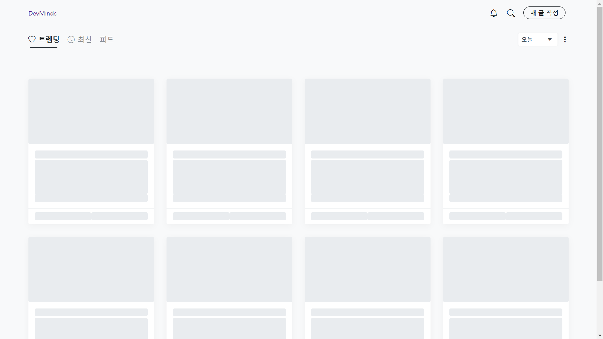
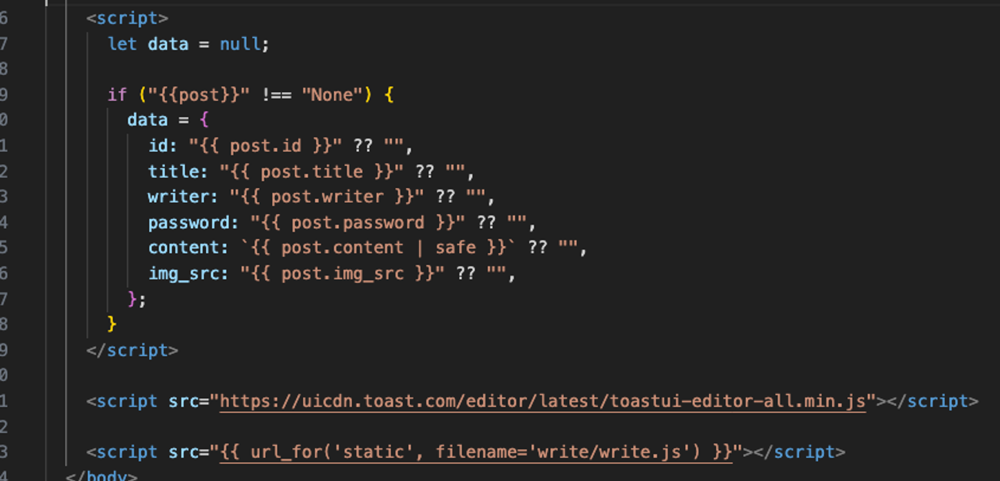
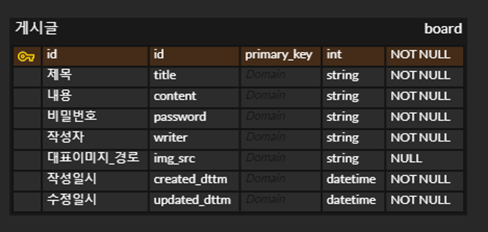
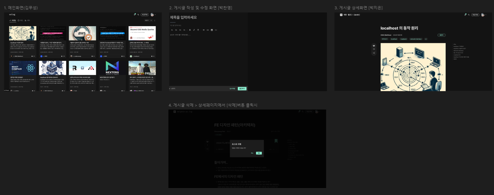

# DevMinds

🌐 https://pcy474.pythonanywhere.com/

## 🙇🏻‍♀️ **DevMinds 블로그 서비스**

> 개발자들의 생각을 공유한다는 의미를 담은 블로그 웹사이트입니다.

- 프로젝트 주제: 기록 블로그
- 개발 기간: 2024.06.12 ~ 2024.06.14

## 📌 **사용기술**

- 언어: html5, python, Javascript
- 프레임워크, 라이브러리: bootstrap, flask, toastui-editor
- 협업 툴: github, notion

## 💡**기능별 담당자**

| 기능화면            | 담당자                                |
| ------------------- | ------------------------------------- |
| Main(게시글 리스트) | [김무성](https://github.com/kmuseong) |

- [🔗 게시글 목록 화면](https://pcy474.pythonanywhere.com/)
- 게시글 리스트 API 구현
- 무한 스크롤 구현  
  
  - js 스크롤 시 데이터를 불러오는 함수 실행
    <br/>
  - py paginate를 사용하여 설정한 값만큼 데이터 가져오기
    
    - 로딩화면
      - loading 시 더미데이터를 보이도록 했어요.
    - 정렬기능
      - 최신순, 오래된순
      - 날짜별
        - 전달 받은 date 값을 조건 문으로 start_date와 end_date 값을 설정

| 기능화면                      | 담당자                                  |
| ----------------------------- | --------------------------------------- |
| 게시글 Form(게시글 생성/수정) | [박찬영](https://github.com/Dolphin-PC) |

- 게시글 `작성` `수정` `삭제` API 구현
- 게시글 작성/수정 화면, data 존재여부에 따른 분기처리
  - `{{ post }}` 데이터가 있다면, `data` 변수에 값을 할당하여 `수정화면`으로 사용되도록 했어요.
    <br/>
- [toastui-editor](https://ui.toast.com/tui-editor) 라이브러리 활용
  - toastui-editor를 통해, 게시글 내용을 html코드로 변환했어요.
  - image 업로드의 경우에는, url링크로만 업로드 되도록 기능을 제한했어요.

| 기능화면                       | 담당자                             |
| ------------------------------ | ---------------------------------- |
| 게시글 Detail(게시글 상세보기) | [박지은](https://github.com/je-pa) |

- 게시글 password 확인 API 구현
- 게시글 조회 화면 구현

## 🤽🏻 **트러블 슈팅**

- [1. API 네이밍 설계](https://www.notion.so/dolphin-pc/API-90b436e53c7543f6a893d76bf7a8721f?pvs=4)
- [2. 게시글 수정 화면 진입, 검증](https://www.notion.so/dolphin-pc/b69f6038b6b345a8a6d4272c99313d3a)

## 👍🏻 **KPT**

- **Keep** (유지하고 싶은 좋은 점)

  - [👪 원활한 협업] 각자의 branch를 통해 원활한 `C`ode `I`ntegration이 가능했습니다.
    - Git Branch 전략
      - feature → dev → main
      - 
  - [🌐 배포 자동화] Shell Script를 통해 통합된 코드의 `배포과정을 자동화` 했습니다.

    1. deploy.sh 파일 작성

       ```bash
       # 1. backup
       cd
       rm -rf ./bak/*
       mv -f ./prod/* ./bak/
       echo "== 1. DONE :: BackUp to bak ==="

       # 2. unzip
       cd
       unzip -q archive.zip -d ./prod/
       echo "== 2. DONE :: Unzip to Prod ==="

       # 3. 가상환경 셋팅
       echo "== 3. Start Setting virtualenv =="

       cd
       cd ./prod
       python -m venv prod_env
       echo "== 3. End Setting virtualenv =="

       echo "== 4. Start install requirements =="
       source prod_env/bin/activate
       pip install -r requirements.txt
       deactivate
       echo "== 4. End install requirements =="

       echo "*** All Done! Please Restart Server ***"
       ```

    2. deploy.sh, archive.zip 파일 업로드
    3. bash deploy.sh 명령어로 배포 끝!

  - [📌 코드 Split] `관심사` 기준으로 코드를 분리해서 **`가독성`과 `재사용성`을 높였어요.**
    - [app.py](http://app.py) 코드 split
      1. app.py코드를 src/\*.py 파일에서 import했어요.
    - html파일 split
      - header.html, footer.html
        - bootstrap, jQuery cdn을 포함하고 있어요.
      - js, css 파일 분리

- **Problem** (개선하고 싶은 불편한 점)
  - python, js의 자동완성기능 부재
    flask서버에서 전달해준 `데이터 객체의 속성을 알 수 없어`, 매번 flask서버의 응답을 보고 작성해주는 것이 번거로웠어요.
- **Try** (다음에 시도해볼만 한 점)

  - 개발 시간이 더 있었다면, `댓글기능`, `태그(뱃지)기능`을 추가하면 좋았을 것 같습니다.
  - 로그인 기능
    1. 로그인 기능이 없어, 게시글 비밀번호로만 데이터를 관리해야 하는 `보안 약점`
    2. 추천기능, 마이페이지 기능을 개발하기 위해서는 로그인 기능이 선행되어야 함

## 🪛 **기타 Tools**

### ERD

https://www.erdcloud.com/d/Sekyh2JNGjGyvPtXC
<br/>

### 와이어프레임

https://www.figma.com/design/Ad5pAtrliRvzKJeDMbaXpB/DevMinds?node-id=0-1&t=9Ku8EB5q1C8O3Rog-0

- velog 사이트를 벤치마킹했습니다.
  <br/>
